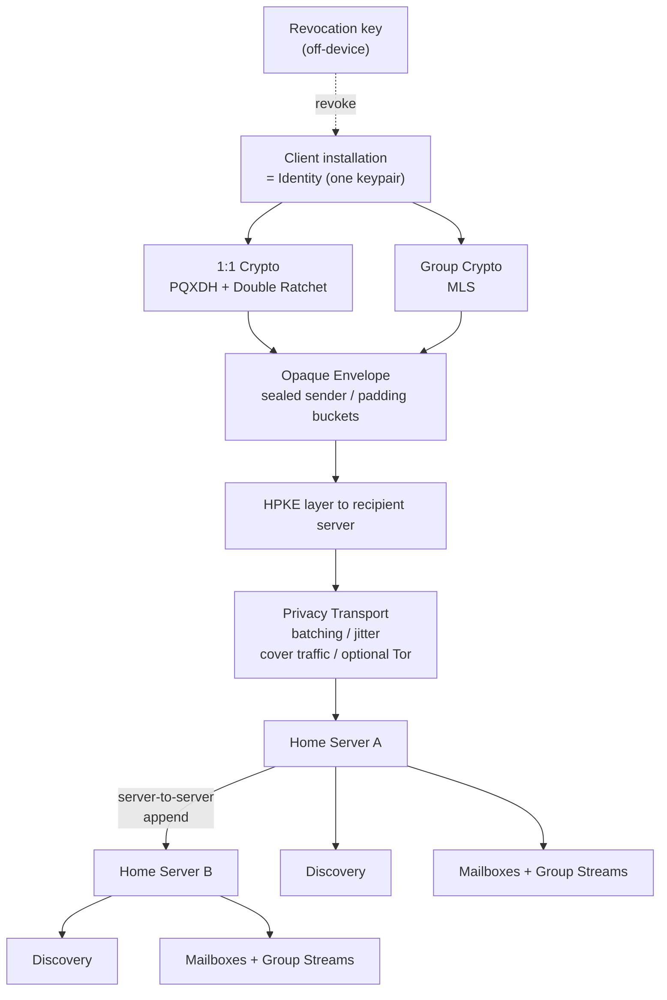
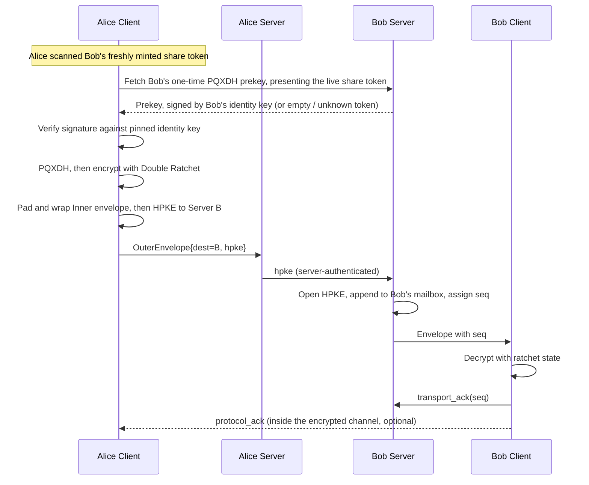
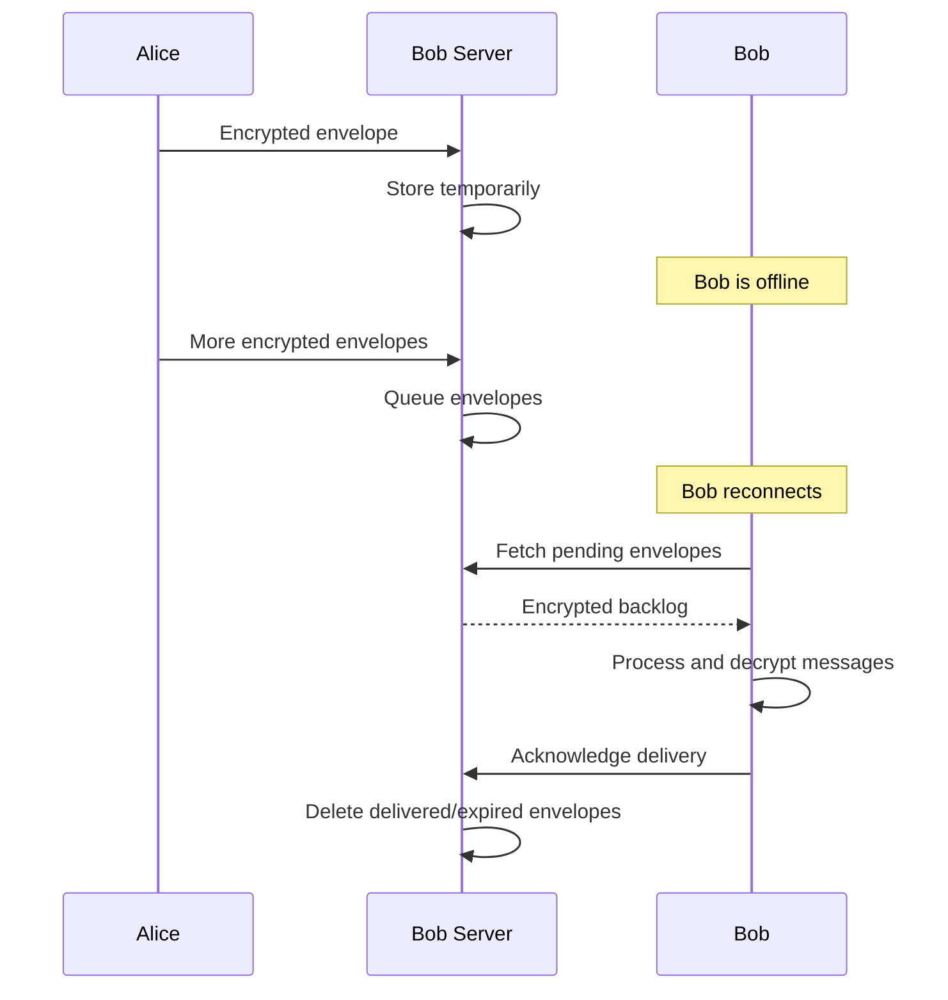
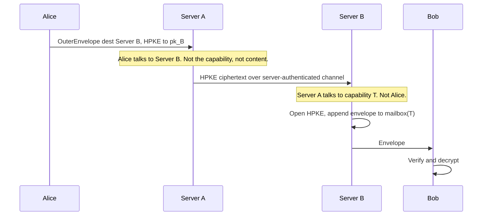
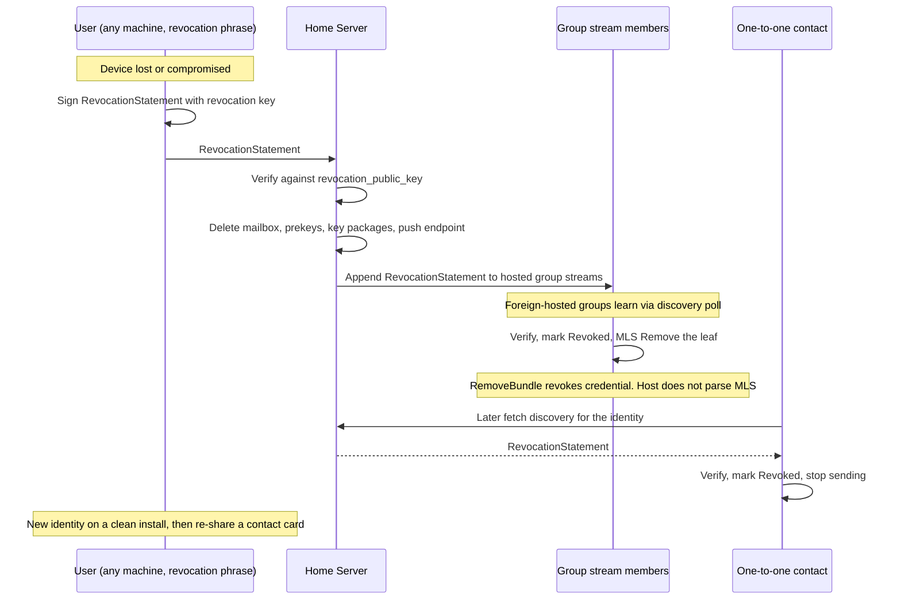
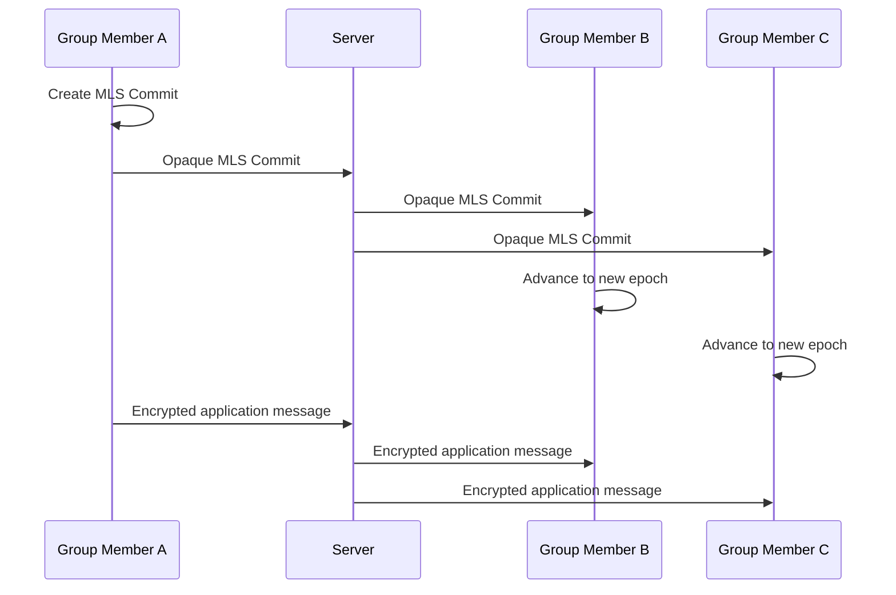
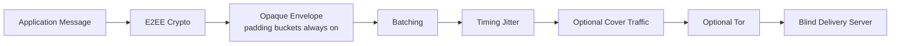

# Nemo Messenger

**Status:** Draft, revision 9 (2026-09-20)<br>
**Document type:** Product requirements and architectural specification<br>
**Scope:** Identity, messaging, cryptography, delivery, privacy, federation, voice calls, and infrastructure<br>
**Decision history:** [`docs/decisions/`](docs/decisions/README.md)<br>
**Protocol specifications:** [`docs/protocol/`](docs/protocol/README.md)

---

# 0. Key Architectural Decisions

The choices below are binding for the current design. Each one has a full record in [`docs/decisions/`](docs/decisions/README.md) with context, pros, cons, rejected alternatives and history. When a decision changes, a new record supersedes the old one; the old record is kept. This section is a summary; the records are authoritative.

| Decision | Summary | Record |
| --- | --- | --- |
| Untrusted server | The server is infrastructure, not authority. All content is E2EE; the server stores ciphertext temporarily, holds no user keys, and cannot read, forge or substitute. | [ADR-0001](docs/decisions/0001-untrusted-server-blind-delivery.md) |
| Cryptographic identity | Users and servers are keypairs, `id = H(pubkey)`. No accounts, no registry. The user-to-server binding is a statement signed by the user, so identity is portable. On migrate the old server drops tokens, prekeys, contact capabilities, and the old mailbox. | [ADR-0002](docs/decisions/0002-cryptographic-identity-no-registry.md) |
| One key, one installation | One client installation is one identity. No device layer, no linking, no key hierarchy. A new device is a new identity. | [ADR-0003](docs/decisions/0003-single-key-identity.md) |
| Revocation | Every identity has a separate revocation key, exported once and kept off-device. Its only power is to kill the identity. Clients MUST refresh discovery for 1:1 contacts and for every MLS-group identity, then MUST Remove. Host drops the credential on a RemoveBundle, not by parsing MLS. No successor, no recovery. | [ADR-0004](docs/decisions/0004-revocation-key.md) |
| Cryptography | Double Ratchet with post-quantum setup (PQXDH, libsignal-class) for 1:1; MLS for groups (not PQ; clients MUST periodically commit Updates). One-time prekeys only; at most one reserved per live share token; a new 1:1 waits if the stock is empty. MLS-only was evaluated and rejected. | [ADR-0005](docs/decisions/0005-double-ratchet-and-mls.md) |
| Discovery | Invite-first. Contacts exchange a contact card out of band. No usernames, no global lookup. Clients gossip home-server binding `seq`. | [ADR-0006](docs/decisions/0006-invite-first-discovery.md) |
| Share tokens | Every share (QR or link) mints a new one-time, short-TTL token. QR is that token drawn as a picture. Two people need two codes. Prekey fetch reserves at most one key per token. | [ADR-0007](docs/decisions/0007-one-time-share-tokens.md) |
| Addressing | Envelopes are addressed by random delivery capabilities, never by identity. Share tokens are one-time; contact capabilities are private per conversation; member credentials are not mailbox tokens. | [ADR-0008](docs/decisions/0008-capability-based-delivery.md) |
| Sealed sender | No sender field on any server-visible envelope. | [ADR-0009](docs/decisions/0009-sealed-sender.md) |
| Padding | Every envelope is padded to a fixed size bucket, always on. | [ADR-0010](docs/decisions/0010-padding-buckets.md) |
| Version field | Every card, envelope and server-to-server frame begins with a protocol version. | [ADR-0011](docs/decisions/0011-protocol-version-field.md) |
| Identifiers | No globally meaningful message IDs; only per-container sequence numbers. | [ADR-0012](docs/decisions/0012-no-global-message-identifiers.md) |
| Timestamps | Server receipt times are internal, coarse, and never returned to clients. | [ADR-0013](docs/decisions/0013-internal-server-timestamps.md) |
| Envelope TTL | Inner envelope may carry a small fixed `ttl_bucket` for early drop of undelivered ciphertext. | [ADR-0014](docs/decisions/0014-sender-chosen-ttl-bucket.md) |
| Mailbox | Mailboxes and group streams are bounded opaque logs; oldest envelopes are dropped when retention is exceeded. Transport ack, protocol ack and user receipt are distinct. | [ADR-0015](docs/decisions/0015-bounded-mailbox-log-and-acks.md) |
| Routing | Server-to-server. When A ≠ B, the sender's server never sees the destination mailbox and the recipient's server never sees the sender. Same-server (A = B) sees both ends; that is accepted. | [ADR-0016](docs/decisions/0016-server-to-server-routing.md) |
| Groups | Each MLS group is hosted on one server as an ordered opaque stream. The host fans out to member mailboxes. Join is signed invite → pending accept → signed admit. Stream append uses a member credential, except a host-only verified RevocationStatement. | [ADR-0017](docs/decisions/0017-server-hosted-group-streams.md) |
| Group join | Mailbox token ≠ member credential. Signing keys MUST be in MLS before invite. Bound invitee_binding is a hash commitment. Inviter admits or relays proof over MLS. Admit requires a discovery revoke check. Credential dies when Remove is admitted. | [ADR-0018](docs/decisions/0018-group-join-and-member-credentials.md) |
| Attachments | 1:1: padded envelope in the recipient mailbox. Groups: one encrypted object on the host; fetch is write-once 256-bit token + member credential over S2S. No public CDN, no file key on the server. | [ADR-0019](docs/decisions/0019-attachment-as-padded-envelope.md) |
| Push | Push carries an opaque wake token only; one priority class per platform; the device fetches its own ciphertext. | [ADR-0020](docs/decisions/0020-opaque-push-wakeup.md) |
| Privacy layer | Metadata protection is a separate tunable layer with modes; Tor optional; client-side cover traffic and constant-rate modes deferred but wire-compatible. | [ADR-0021](docs/decisions/0021-privacy-layer-and-modes.md) |
| Data minimisation | No server-side presence, typing, receipts, contact lists or analytics; minimal purpose-bound logs. | [ADR-0022](docs/decisions/0022-server-side-data-minimisation.md) |
| Backup | No identity recovery, never any cryptographic-state recovery, no history backup in v1. | [ADR-0023](docs/decisions/0023-no-backup-no-recovery.md) |
| Voice calls | Signaling inside the E2EE conversation; WebRTC media with self-hosted TURN; always-relay (`iceTransportPolicy=relay`, no P2P); 1:1 via DTLS-SRTP; groups (deferred) via SFrame keyed from MLS through a blind SFU. | [ADR-0024](docs/decisions/0024-voice-call-architecture.md) |
| Open and self-hosted | Fully self-hostable, open source, standard audited cryptography only, no custom primitives. | [ADR-0025](docs/decisions/0025-self-hostable-open-source-no-custom-crypto.md) |
| Platforms | Android, Linux, Windows first; iOS/macOS later; no web in v1; single Rust core. | [ADR-0026](docs/decisions/0026-target-platforms.md) |
| Development order | Security model, then protocols, then envelope, delivery, federation, privacy, application; APIs and schemas last. | [ADR-0027](docs/decisions/0027-protocol-first-development-order.md) |
| Implementation stack | Rust core and Rust server; libsignal primitives + OpenMLS; Compose Multiplatform + UniFFI; Axum + sqlx + PostgreSQL + Caddy; spec/server MIT, client AGPL; no Cargo workspace until the protocols exist. | [ADR-0028](docs/decisions/0028-implementation-languages-and-libraries.md) |
| Crypto encodings | SHA-256 ids; CBOR contact card ≤400 bytes (`nemo:1:` URI); MLS suite 0x0003; Update every 7 days / 72 h before send; 30-minute share tokens. | [ADR-0029](docs/decisions/0029-cryptographic-identifiers-and-encodings.md) |
| Envelopes | Version-1 buckets: text 1/4/16 KiB inner, 20 KiB outer; attachments up to 16 MiB; ttl 60s/1h/1d; no sender field. | [ADR-0030](docs/decisions/0030-envelope-buckets-and-layout.md) |
| Mailboxes | 14-day / 500 MiB default retention; owner-only fetch; DR skip window ≥2000. | [ADR-0031](docs/decisions/0031-mailbox-retention-and-owner-auth.md) |
| Federation hop | Server Ed25519 + HPKE X25519; TLS 1.3 with pinned keys; not Web PKI. | [ADR-0032](docs/decisions/0032-server-signing-key-and-federation-tls.md) |
| HTTP and schema | Client-to-home `/v1` on localhost HTTP; Caddy terminates TLS; CBOR/octet-stream, never JSON; Postgres DDL from phases 1–5 only. | [ADR-0033](docs/decisions/0033-local-http-api-and-postgres-schema.md) |
| Local vault | App passphrase (min 8); Argon2id; SQLCipher in `nemo-core`; revocation mnemonic never stored; lost passphrase is a lost identity. | [ADR-0034](docs/decisions/0034-local-vault-passphrase.md) |
| TURN credentials | Per-call HMAC-SHA1 REST creds from `POST /v1/turn`; username is not identity; no credentials table. | [ADR-0035](docs/decisions/0035-ephemeral-turn-credentials.md) |

## 0.1 Non-goals

The following are deliberately **not** goals of this product. They are listed so that nobody "fixes" them later without a new decision record.

* Multi-device: one person using two installations appears as two identities.
* Identity recovery after device loss.
* Recovery or synchronisation of ratchet / MLS state, under any circumstances.
* Message history backup (v1).
* Global usernames or directory lookup (v1).
* Hiding group membership from the group's hosting server (v1).
* Adding someone to a group without their client accepting (unilateral MLS Add).
* Peer-to-peer call media (always TURN; P2P would be a later record).
* A public attachment CDN, content-addressed file archive, or file key stored on a server.
* Protection against a global passive observer without the optional privacy layer.
* Protection of plaintext already present on a compromised device.
* Enforcing disappearing messages or delete-for-everyone against a non-cooperating recipient.
* Voice or video calls over Tor at usable quality.

---

# 1. Product Vision

Build an open-source, self-hostable messenger where:

* User identity is based on cryptographic keys rather than a server-assigned username.
* One client installation is one identity; there is no device layer above it (ADR-0003).
* The server is infrastructure, not a trusted authority.
* All message content is end-to-end encrypted.
* The server cannot decrypt messages.
* Server-side persistent data is minimized.
* Messages can be stored temporarily for offline delivery.
* Independent servers can communicate.
* A user can move their identity between servers.
* 1:1 messaging and groups use established cryptographic protocols.
* Metadata privacy is treated as a separate security layer from message encryption.
* Tor is supported but not mandatory.
* Stronger privacy modes can trade battery, bandwidth, and latency for stronger traffic-analysis resistance.

The product should be thought of as:

> **A self-hostable cryptographic messenger with blind delivery infrastructure and optional strong metadata privacy.**

---

# 2. Product Principles

## 2.1 User-owned identity (ADR-0002)

The server does not fundamentally own a user's identity.

```text
Identity Keypair
       |
       v
Identity Public Key
       |
       v
identity_id = H(identity_public_key)
```

The identity must therefore remain portable between servers.

A server may maintain internal database identifiers for operational purposes, but those identifiers must not become the user's cryptographic identity.

---

## 2.2 Untrusted infrastructure (ADR-0001)

The server should be considered potentially malicious.

It may:

* observe transport metadata available to it;
* drop messages;
* delay messages;
* replay messages;
* return stale discovery information;
* provide malicious routing information;
* become compromised;
* be operated by an adversarial administrator.

It must not be able to:

* decrypt message content;
* forge a user's cryptographic identity;
* silently replace a verified public key;
* recover historical message keys from normal server state;
* become the cryptographic authority for user identities.

---

## 2.3 Encryption and metadata privacy are different problems (ADR-0021)

End-to-end encryption protects:

* message content;
* attachments;
* group application data.

It does not automatically protect:

* IP addresses;
* connection timing;
* packet sizes;
* connection duration;
* traffic frequency;
* social graph information;
* group membership;
* server access patterns.

Therefore the architecture must explicitly separate:

```text
                    Messenger
                        |
             +----------+----------+
             |                     |
      Cryptographic / Envelope     Privacy Transport
             |                     |
      E2EE / FS / PCS        Metadata protection
      1:1 ratchet            Batching
      MLS groups             Jitter
      Key management         Cover traffic
      Padding buckets        Optional Tor
      (always on, ADR-0010)
```

---

# 3. Identity Model

## 3.1 User identity

Each client installation owns a long-term identity keypair.

```text
Identity
├── identity_public_key        Ed25519 signing key
├── identity_private_key
├── identity_id = H(identity_public_key)
├── revocation_public_key      see 3.3
└── protocol keys signed by the identity key
    ├── PQXDH prekeys          1:1 session setup (ADR-0005)
    └── MLS key packages       group membership (ADR-0005)
```

The private key is generated and controlled by the client and never leaves the installation.

The server receives only the public material required for discovery, verification, and protocol establishment.

The identity key signs all other keys the identity uses. A single fingerprint of the identity public key therefore covers 1:1 sessions, group membership and calls.

---

## 3.2 One installation, one identity (ADR-0003)

There is no device model. **A client installation is an identity.**

```text
Person
│
├── Phone installation    -> Identity P  (its own keypair)
│
└── Laptop installation   -> Identity L  (its own keypair)
```

* A person using two installations has two identities. Contacts see two contacts; groups must include both.
* There is no key hierarchy, no device list, no enrollment, no linking, and no key more privileged than the installation's own key.
* Moving to a new device means creating a new identity and being re-added by every contact.
* A lost, wiped or stolen device is a lost identity. The only external control over an identity is revocation (3.3).

This removes device enrollment, device revocation, cross-device state synchronisation and root-key custody from the protocol. The cost is that multi-device is a non-goal (0.1).

---

## 3.3 Revocation key (ADR-0004)

Each identity has a second, independent Ed25519 keypair whose only power is to revoke the identity.

```text
Revocation
├── revocation_public_key      published in the contact card
└── revocation_private_key     shown once (24 words / QR), stored off-device, never kept by the client
```

Revocation statement:

```text
RevocationStatement
├── identity_id
├── "revoked"
├── coarse_timestamp
└── signature by revocation_private_key
```

On a valid statement:

* the home server deletes the mailbox, key material and push endpoint, serves the statement from discovery, and appends it to every group stream it hosts that contains the identity;
* clients mark the contact revoked, stop sending, refuse new sessions from that key, and **MUST** commit MLS Remove in every group they share with that identity.

The revocation key cannot authorise a new identity, recover messages or do anything other than revoke. It does not protect messages already readable on a stolen device.

Clients **MUST** refresh discovery on a coarse interval (hours) for existing 1:1 contacts **and** for every identity in every MLS group they belong to, then **MUST** commit MLS Remove. The host fans the `RemoveBundle` to the pre-revoke set (including the removed member), then drops that member credential and prunes fan-out (ADR-0018). It does not parse MLS.

---

## 3.4 Contact card (ADR-0006)

A contact card is the only way to establish a contact (see section 20).

```text
ContactCard
├── version
├── identity_public_key
├── revocation_public_key
├── home_server_binding         signed by identity key:
│   ├── server_id
│   ├── server_public_key       used for the HPKE layer in section 10
│   ├── endpoints
│   ├── seq                     monotonically increasing; clients pin the highest seen
│   └── expires_at
└── share_token                 one-time, short-TTL introduction token minted for this share (ADR-0007)
```

Showing a QR, copying a link, or exporting a file **mints a new token**. QR and link are encodings of the same object. Two people require two codes. Scanning a freshly minted QR in person is the verification step.

---

## 3.5 Local nicknames

Human-readable names are optional and local.

When a user adds a contact:

```text
identity_id -> local_nickname
```

Example:

```text
7f91...ab2c -> "Alice"
```

The nickname belongs to the local client.

The server does not need to know it.

This means:

* no mandatory global username;
* no centralized username registry;
* local personalization;
* identity remains independent of a display name.

---

# 4. Server Identity (ADR-0002)

Servers should also have cryptographic identities.

```text
Server Keypair
      |
      v
Server Public Key
      |
      v
server_id = H(server_public_key)
```

This allows clients to identify servers cryptographically instead of trusting a central registry.

A client should be able to verify that it is communicating with the expected server identity.

---

# 5. Server Architecture

The server consists logically of two main services.

```text
Messenger Server
│
├── Discovery Service
│
└── Blind Delivery Service
```

Other infrastructure components may exist around them:

```text
Messenger Server
│
├── Discovery Service          key material, home-server bindings, revocation statements
├── Blind Delivery Service     mailboxes (1:1) and group streams (MLS), see ADR-0016 and ADR-0017
├── Federation Peer            server-to-server append, section 10
├── Push Gateway Integration
├── Media Services             TURN and SFU for calls, section 64 (optional)
└── Administrative / Operational Layer
```

Initially, discovery and delivery can run in the same deployment.

They should still be separate domain responsibilities so they can later be separated physically.

---

# 6. Discovery Service

The Discovery Service provides cryptographic information required to establish communication.

Data served, for an identity the requester already knows:

* identity public key;
* PQXDH one-time prekeys, **only** when the requester presents a live unused share token (ADR-0005, ADR-0007);
* current signed home-server binding;
* revocation statement, if the identity is revoked;
* server endpoints, capabilities and cryptographic server identity.

Knowledge of `identity_id` or an old contact card is not enough to fetch a prekey. The fetch does not consume the token. At most one one-time prekey is reserved per live token; a repeat fetch returns that same reserved key. MLS KeyPackages are issued on group accept and travel in-band to the admitting member (ADR-0018), not left infinitely fetchable from discovery and not stored in the clear on the group host.

Discovery answers "give me material for identity X". It does **not** answer "who is X" or "find people named X"; there is no lookup by name, phone number or any other attribute (ADR-0006).

Discovery responses are **untrusted input**.

The client must verify returned cryptographic information rather than blindly trusting the server: prekeys must be signed by the identity key; home-server bindings must carry a `seq` not lower than the one previously pinned; revocation statements must verify against the revocation public key from the contact card. Clients gossip the latest observed home-server binding `seq` inside existing encrypted sessions and alert on conflict. Clients MUST periodically refresh discovery for existing 1:1 contacts and for every identity in every MLS group they belong to, on a coarse interval (hours), so a revocation is noticed without waiting for the next send (ADR-0004).

The discovery service should not contain:

* plaintext messages;
* permanent message history;
* contact nicknames;
* read receipts;
* typing state;
* last-seen state;
* unnecessary social graph information.

---

# 7. Blind Delivery Service (ADR-0001, ADR-0015)

The Blind Delivery Service provides temporary asynchronous message storage and delivery.

Conceptually:

```text
Client
  |
  | encrypted envelope
  v
Blind Delivery Service
  |
  +-- temporary queue
  +-- expiration
  |
  v
Recipient Client
```

The delivery service must not need:

* message plaintext;
* conversation keys;
* application-level encryption keys;
* the sender of any envelope (sealed sender, ADR-0009).

It should store only what is necessary to deliver opaque encrypted envelopes.

It holds two kinds of containers:

```text
Mailbox        per recipient identity; receives 1:1 envelopes and group fan-out
Group stream   per MLS group hosted on this server; ordered, fanned out to member mailboxes (ADR-0017)
```

Both are bounded opaque logs with server-assigned, per-container sequence numbers:

```text
append(capability, envelope)            idempotent by client-supplied opaque token
fetch(mailbox_capability, cursor, n)
ack(mailbox_capability, up_to_seq)      deletes acknowledged envelopes
```

---

# 8. Server Storage Model (ADR-0022)

The persistent server state should be minimized.

## Persistent data

```text
Server identity
Identity public keys
Home-server bindings (signed by identity)
Revocation statements
One-time prekeys (finite stock)
Share tokens and contact capabilities -> mailbox mapping
Member credentials (per group, not mailbox tokens)
Group streams: opaque group id, member capability set, member credentials
Peer servers: id, public key, endpoints
Server capabilities
```

## Temporary data

```text
Encrypted message envelopes (mailboxes and group streams)
Per-container sequence cursors
Expiration metadata (internal, never returned to clients)
Outbound federation queue
Push wakeup state
Ephemeral TURN / SFU credentials
```

## Data that should not exist server-side

```text
Message plaintext
Permanent message history
Any private key belonging to a user
Conversation encryption keys
Sender identifiers on envelopes
Contact nicknames
Contact lists (beyond group member capability sets)
Read receipts
Typing indicators
Last-seen state
Unnecessary analytics
Unnecessary request logs
```

---

# 9. Offline Messaging

Offline messaging is a core requirement.

If Bob is offline:

```text
Alice
  |
  v
Encrypted Message
  |
  v
Bob's Delivery Service
  |
  +-- Temporary Encrypted Storage
  |
  +-- Expiration
  |
  v
Bob reconnects
```

The server temporarily retains ciphertext until delivery or expiration.

The server should not become the permanent message history.

---

## 9.1 Large offline backlog

If Bob is offline while Alice sends 1,000 messages:

```text
M1
M2
M3
...
M1000
```

the server may temporarily store all 1,000 encrypted envelopes.

When Bob reconnects:

```text
Bob
 |
 v
Fetch backlog
 |
 v
Decrypt/process messages
```

The client must retain sufficient cryptographic state to support:

* delayed messages;
* out-of-order messages;
* duplicate delivery;
* temporary disconnection.

Mailboxes are bounded. If the backlog exceeds the server's retention (size or age), the oldest envelopes are dropped and the client detects the gap through the sequence numbers. The Double Ratchet and MLS both survive dropped messages; the application must show the user that messages were lost.

---

# 10. Cross-Server Communication (ADR-0016)

Messages are routed **server-to-server**. The sender's client never connects to the recipient's server.

```text
Alice
  |
  | OuterEnvelope { destination_server_id, HPKE(server_B_pk, InnerEnvelope) }
  v
Server A            sees: Alice -> Server B. Does not see the mailbox.
  |
  | forwards the HPKE ciphertext over a server-authenticated channel
  v
Server B            sees: Server A -> capability T. Does not see Alice.
  |
  | opens the HPKE layer, appends padded envelope to mailbox behind T
  v
Bob
```

```text
OuterEnvelope
├── version
├── destination_server_id
└── hpke_ciphertext = HPKE_Seal(server_B_public_key, InnerEnvelope)
    InnerEnvelope is padded to an outer bucket before HPKE (ADR-0010)
    so ciphertext length does not reveal the inner mailbox bucket

InnerEnvelope
├── delivery_capability
├── ttl_bucket                     optional early-expiry request (ADR-0014)
└── padded_message_envelope        opaque to every server (ADR-0009, ADR-0010)
```

Properties:

* When **A ≠ B**, neither server sees both ends. Server A learns which *servers* Alice talks to; Server B learns which *capabilities* receive traffic from Server A. Server B never sees Alice's IP or a client session from her.
* Server A can queue while Server B is unreachable.
* Server B's public key comes from Bob's contact card (home-server binding, 3.4) and is refreshed through an existing session when Bob changes server.
* Servers authenticate each other with their server keys (section 4). Web PKI may protect the transport but is not the source of server identity.
* Same-server delivery uses the identical structure with A = B. The operator then sees Alice → Bob's capability. That is accepted, with F1.
* Group fan-out (section 17) uses the same primitive.

The federation protocol must specify: server authentication, the HPKE suite, replay protection on the server-to-server hop, retry and expiry policy, and per-peer rate limiting.

The client does not need to know whether the destination is local or remote; it always builds the same OuterEnvelope.

---

# 11. Identity Portability (ADR-0002)

The same cryptographic identity should be able to move between servers.

Before:

```text
Identity X
   |
Server A
```

After:

```text
Identity X
   |
Server B
```

The identity key remains the same and never leaves the installation. Portability means moving the **mailbox and published material** to another server, not moving the key to another device (that would be a new identity, ADR-0003).

Procedure:

1. The client registers with Server B, uploads a fresh one-time prekey stock, and obtains a new mailbox capability. KeyPackages are produced later on group accept and travel in-band to the admitting member (ADR-0018).
2. The client signs a new home-server binding with `seq` higher than the current one and publishes it on Server B (and, if still reachable, on Server A).
3. **Whenever** Server A observes a `HomeServerBinding` with `seq` higher than the one it stores, it **MUST** drop unused share tokens and the old one-time prekey stock, revoke contact capabilities, and disable that mailbox (ADR-0002). This runs even if A was unreachable during the move and sees the new binding later.
4. The client sends the new binding and new contact capabilities to every contact and group over the existing encrypted sessions.
5. For each group, the client **MUST** refresh fan-out on the host under its member credential: replace `{delivery_capability, home_server}` (ADR-0017). This is not group migration.
6. Contacts pin the new `seq`. Anyone who later fetches the old binding from Server A rejects it as stale.
7. First contact **MUST** resolve the current home-server binding via discovery, not the card snapshot alone.

The old server cannot impersonate the identity because it never held the identity key and cannot produce a binding with a higher `seq`.

Groups hosted on Server A are not moved by this procedure; group migration is deferred (section 52).

---

# 12. Cryptographic Architecture

The system should use established cryptographic protocols rather than inventing a new messaging protocol.

Decided architecture (ADR-0005):

```text
Messenger
│
├── 1:1 Conversations
│   ├── PQXDH            asynchronous, post-quantum session setup
│   └── Double Ratchet   per-message forward secrecy, continuous PCS
│   (libsignal or an equivalent audited implementation)
│
└── Group Conversations
    └── MLS (RFC 9420)   epochs, commits, exporter for calls
        (OpenMLS / mls-rs or an equivalent audited implementation)
```

Both protocols authenticate with the same identity key (3.1). The X25519 key for PQXDH and the HPKE init key in MLS key packages are separate keys signed by it, so one fingerprint covers everything.

MLS-only (1:1 as a two-leaf group) was evaluated and rejected for v1: it needs a server-side commit sequencer for every 1:1 conversation, its post-compromise security depends on members committing, and standardised post-quantum ciphersuites are not yet available. See ADR-0005 for the full comparison.

A 1:1 conversation that grows into a group starts a new MLS group; there is no in-place upgrade.

**Prekeys are one-time only.** Discovery serves a finite stock, and only to a requester who presents a live unused share token. At most one prekey is reserved per token; a repeat fetch returns that same reserved key. There is no reusable last-resort prekey. If the stock is empty, a **new** 1:1 cannot start until the recipient comes online and restocks. Existing conversations are unaffected.

**Groups are not post-quantum.** MLS PQ ciphersuites are still drafts; do not claim PQ for groups. Clients **MUST** periodically commit MLS Updates so post-compromise security does not depend on someone happening to speak. The interval is specified with the group state machine.

---

# 13. 1:1 Messaging

A 1:1 conversation should provide:

* end-to-end encryption;
* forward secrecy;
* post-compromise security;
* asynchronous delivery;
* offline support;
* deniable authentication (a property of X3DH/PQXDH that MLS does not offer).

A 1:1 conversation is exactly one pair of identities. The server holds only two mailboxes; it does not sequence or interpret anything.

Conceptually:

```text
Alice
 |
 | encrypted message
 | ratchet state
 v
Opaque envelope
 |
 v
Server
 |
 v
Opaque envelope
 |
 v
Bob
 |
 v
Decrypt with Bob's ratchet state
```

The server only transports the ciphertext.

If Bob's one-time prekey stock is empty, or Alice has no live share token, Alice's client refuses to start a new session and waits (ADR-0005). It does not fall back to a reusable last-resort key.

---

# 14. Forward Secrecy

Forward secrecy is required.

The basic idea is:

```text
Old state
   |
   | ratchet/update
   v
New state
```

Old cryptographic secrets should be deleted when they are no longer needed.

If the device is compromised later, the attacker should not automatically be able to derive historical message keys.

Conceptually:

```text
Historical messages
        |
        X
        |
Current device compromise
```

Forward secrecy therefore protects historical communication against later compromise of the current cryptographic state.

---

# 15. Post-Compromise Security

The system should automatically recover after compromise.

Conceptually:

```text
Device compromised
        |
        v
Attacker gets current state
        |
        v
Fresh cryptographic update
        |
        v
New state
        |
        v
Future communication becomes protected again
```

This recovery should be provided by the selected cryptographic protocols rather than by application-level custom crypto.

---

# 16. Message Key Lifecycle

Historical ciphertext can remain on storage while the keys needed to decrypt it are deleted.

For example:

```text
Ciphertext:
M1 M2 M3 M4 M5

Keys:
K1 K2 K3 K4 K5
```

After the corresponding messages are safely processed and the protocol no longer needs the keys:

```text
Ciphertext:
M1 M2 M3 M4 M5

Keys:
deleted
```

An attacker obtaining only current state should not be able to reconstruct those old message keys.

Local application behavior must nevertheless account for messages that remain unread, delayed, or out of order.

---

# 17. MLS Groups

Groups should use MLS.

An MLS group evolves through cryptographic epochs.

```text
Epoch 0
   |
 Commit
   v
Epoch 1
   |
 Commit
   v
Epoch 2
   |
 Commit
   v
Epoch 3
```

Membership changes and key updates advance the cryptographic state.

The server transports opaque protocol objects such as:

* Welcome messages;
* Proposals;
* Commits;
* application messages.

The server does not need to decrypt their content.

## 17.1 Group hosting and ordering (ADR-0017)

MLS requires all members to agree on exactly one Commit per epoch, and Proposals must precede the Commit that references them. Some component must impose a linear order.

Each group is hosted on **one server** (the creator's home server) as an **ordered opaque stream**:

```text
Group stream (on hosting server)
├── opaque_group_id
├── member capability set        {delivery_capability, home_server} per accepted member
├── member credentials           issued on admit; stream append + group-file fetch
├── pending_joins[]              reserved until a client-signed admit; expire with invite TTL
└── objects, each with a server-assigned sequence number
    seq 1  Commit
    seq 2  application message
    seq 3  Proposal
    seq 4  Commit
    ...
```

Rules:

* A member appends an object to the stream **with their member credential**. The hosting server assigns the next sequence number and fans the object out to every member's home mailbox using the server-to-server primitive (section 10). A mailbox delivery capability cannot append to the stream or change fan-out (ADR-0018). The one host-only append is a verified `RevocationStatement` (ADR-0004). It is not an MLS message. The host **MUST NOT** append Proposals, Commits, Welcome, or application messages without a member credential.
* Clients apply the first valid Commit for an epoch in stream order and ignore later ones. A committer waits for its own Commit to come back through the stream before applying it.
* The server never filters or validates MLS content beyond framing. All Commits are delivered; clients decide (RFC 9750 section 5.3). An MLS Remove is one **`RemoveBundle`**: `{opaque_mls_commit, sidecar}` under a single member credential. The sidecar is `{credential_id, "revoke"}` signed with the committer's group signing key. The Commit **MUST** process exactly one Remove, of the leaf bound to that id; N removals are N bundles. Clients **MUST** reject an unframed Remove and reject a bundle that is not that single matching Remove. The host admits both or neither, **fans the object to the pre-revoke set (including the named credential)**, then revokes that **live** credential and **removes that fan-out entry**. It **MUST NOT** parse `opaque_mls_commit`. A sidecar on an Update/Add, or a Commit without a bundle, MUST NOT revoke. Clients **MUST** apply the MLS Remove iff the sidecar names the removed leaf's MLS-published credential; on mismatch they reject the bundle and alert. Recovery is a new admit. Signing-key rotation is an MLS Update plus host-visible `SigningKeyReplace`. Clients **MUST** reject External Commits, external joins, and ReInit.
* A member **MUST** refresh `{delivery_capability, home_server}` on the host under their member credential when they change home server (ADR-0017). That is not group migration.
* Join is **hybrid**. A current member creates a one-time, short-TTL group-invite signed with their **per-group member signing key**. That public half **MUST** be published in MLS before they invite or admit; a copy on the host is a filter hint only. Rotation is an MLS Update plus host-visible `SigningKeyReplace`. Clients **MUST** reject signatures that do not verify against the MLS-published key. The identity key is never sent to the host. If they already have the invitee's card, the invite is bound; `invitee_binding` is `H(identity_public_key || salt)` only — **MUST NOT** put the key or `identity_id` on the host object. The invitee proves that **to the admitting member in-band** with an identity-key signature over `{group_id, pending_id}`. For a bound invite the inviter **MUST** admit, or **MUST** relay the proof and KeyPackage over MLS. The bound proof **MUST NOT** appear in any host-visible accept field. The admitter **MUST NOT** admit if the proof is missing or fails, or if discovery shows a valid `RevocationStatement`. The invitee accepts into a **pending join** with a **reserved, inert `credential_id`**. The KeyPackage **MUST** carry that id in an MLS leaf extension; the admitter **MUST NOT** admit if it is missing or wrong. A member **admits** under their group signing key (typically with MLS Add / Welcome). The host **activates the same reserved id** (MUST NOT mint another), registers the joiner's signing public key, and **adds the mailbox to fan-out before** any admit-associated stream object is fanned (or Welcome is sent in-band). Clients treat the MLS-published id as the leaf's host credential; they **MUST** reject an Update that changes it. The KeyPackage travels in-band to the admitter (or sealed to members); the host MUST NOT store it in the clear. Pending joins expire with the invite TTL. The host **MUST** fan-out a `RemoveBundle` to the pre-revoke set, then revoke the live credential and prune fan-out. It does not parse MLS. Clients **MUST** reject External Commits, external joins, and ReInit.
* Members on other servers never connect to the hosting server; they receive from their own mailbox and send through their own server.
* The group's hosting server is a single point of failure for that group. Group migration to another server is deferred (section 52).

---

# 18. Group Forward Secrecy and Recovery

When an MLS group advances to a new epoch:

```text
Old Epoch
   |
   | Commit
   v
New Epoch
```

old cryptographic material can be removed according to the protocol state machine.

A later compromise should not automatically reveal historical group traffic.

Clients **MUST** periodically commit MLS Updates so a quiet group still heals (ADR-0005). The interval is specified with the group state machine; this document does not pick a number. Groups are not post-quantum.

---

# 19. Group Metadata Limitation

MLS provides strong group cryptographic security, but it does not hide group metadata from the hosting server, and in this design (ADR-0017) it is not meant to.

The hosting server can observe, for each group it hosts:

```text
the opaque group id
the set of member delivery capabilities and their home servers
per-group member signing public keys (not identity keys)
when each object was appended and its padded size
which member credential appended it
which member credential fetched a group file object, and when (ADR-0019)
host-framed fields: reserved/live credential_ids, RemoveBundle sidecar credential_id,
AttachmentReserve {fetch_token, size_bucket, ttl}, SigningKeyReplace public keys
```

It cannot observe:

```text
message content
which identity is behind a capability, beyond what the capability itself reveals
KeyPackage plaintext (in-band or sealed to members; host may keep an opaque blob only)
```

Other servers see only fan-out deliveries into their users' mailboxes, which look like any other server-to-server delivery.

Therefore:

> Group confidentiality and group metadata privacy are separate requirements. In v1, group membership is visible to the hosting server; anonymous group membership is a deferred feature (section 52).

---

# 20. Contact Discovery

Contact discovery is **invite-first** (ADR-0006). The only way to add a contact is to obtain their contact card (3.4) out of band. Every share **mints a new one-time, short-TTL token** (ADR-0007). A QR is that token drawn as a picture, not a durable badge. Two people require two codes.

```text
Bob
 |
 +-- mints a fresh share token; shows it as QR or copies a link
 |
Alice
 |
 +-- scans card: identity key, revocation key, home-server binding, this share's token
 |
 +-- resolves current home-server binding via discovery (not the card snapshot alone)
 |
 +-- fetches Bob's one-time prekey, presenting this live share token
 |   (refuses if the stock is empty or the token is dead; fetch does not consume;
 |    at most one key reserved per token; retry returns that same key)
 |
 +-- establishes PQXDH session; first envelope to the token consumes it
 |
Bob
 |
 +-- both exchange private per-conversation contact capabilities inside the session
 |
 +-- this share token is burned; unused tokens die at TTL
```

Consequences:

* There are no usernames, phone-number lookups or directories. The server never sees a search.
* Server-visible information is limited to "this token was consumed"; the server does not learn that Alice looked for Bob.
* Cold contact with a stranger is not possible in v1.
* A leaked share is one shot and time-bounded. Screenshots become useless after consume or TTL.
* Whoever sees a connect token first can send first and burn it. That race is accepted (ADR-0007). Shares must travel on a channel the user already trusts, or be shown in person.
* Adding someone to a group requires they accept a client-signed group invite, then a member admits them (ADR-0018). If they are already a contact, the invite binds them with a hash commitment, not the identity key on the host. A connect token cannot join a group.

---

# 21. Contact Verification

A malicious discovery service must not be able to silently replace Bob's public key with an attacker's public key.

The product therefore needs a user-visible identity verification mechanism.

Because a contact can only be created from a contact card (section 20), verification happens at exchange time: a card scanned in person is verified; a card received over an untrusted channel is unverified until the fingerprint is compared out of band.

* The fingerprint is a digest of the identity public key only. Since every other key (PQXDH, MLS, revocation) is signed by the identity key, one fingerprint covers all protocols.
* Discovery cannot substitute a key: prekeys that do not verify against the pinned identity key are rejected. Clients gossip the latest home-server binding `seq` in existing sessions and alert on conflict.
* A changed identity key is a different contact, not a "key change" event. The UX shows "New identity" and requires a new card; there is no in-place key rotation (ADR-0003).
* The UX states are: Verified, Unverified, Revoked.

---

# 22. Delivery Capabilities (ADR-0008)

A promising architecture is to separate:

```text
Cryptographic Identity
```

from:

```text
Delivery Destination
```

For example, Bob generates a random capability:

```text
T = random 256-bit token
```

The delivery service internally maps:

```text
T -> Bob's mailbox
```

Alice sends:

```text
POST /delivery/T
```

with an opaque encrypted envelope.

Conceptually:

```text
Bob
 |
 +-- generate T
 |
 +-- register T
 |
 +-- give T to authorized contacts

Alice
 |
 +-- POST /delivery/T
 |
 +-- encrypted envelope
```

This can reduce the need for a direct:

```text
Alice -> Bob
```

identity mapping at the delivery layer.

## 22.1 Capability classes

```text
Share token (ADR-0007)
├── minted per share (QR, link, or file)
├── one-time, short TTL
├── purpose: connect (group invites are a separate signed object, ADR-0018)
├── required to fetch a one-time prekey; fetch does not consume
├── at most one one-time prekey reserved per token; retry returns that same key
└── consume-on-first-envelope; unused tokens expire

Contact capability
├── one per (conversation, recipient)
├── exchanged only inside an established encrypted session
├── never published
└── rotated in-band; old capability kept alive briefly for in-flight messages

Member credential (ADR-0018)
├── reserved (inert) on accept; activated on admit — same id, never a new one
├── published in the MLS leaf extension; clients bind leaf ↔ id from MLS
├── authorises stream append and group-file fetch (with fetch_token)
├── cannot mint invites (invites are signed with the group member key)
├── revoked with no grace after the host fans out a RemoveBundle, then prunes fan-out
└── not a mailbox delivery capability; stealing an inbox token cannot change membership
```

Share tokens exist only for first contact (and to fetch that first prekey). Group invites are client-signed objects (ADR-0018). After first contact, mailbox writes use contact capabilities. Stream append uses the member credential. The server cannot join two conversations of the same recipient by token.

## 22.2 Threats

Delivery capabilities do not solve all metadata privacy problems. They must be designed against:

* token enumeration (tokens are 256-bit random; the server rejects unknown tokens with a constant-time response);
* token correlation (per-conversation scoping; timing correlation remains);
* replay (idempotent append token per envelope, ADR-0012);
* token theft (rotation in-band; a stolen contact capability allows spam into one conversation, not impersonation or group-membership change);
* access-pattern analysis;
* timing analysis;
* token reuse.

---

# 23. Delivery Token Lifecycle (ADR-0008)

A delivery capability should have a lifecycle.

Possible states:

```text
Created
   |
Active
   |
Rotated
   |
Revoked
   |
Expired
```

Decided:

* A contact capability is scoped to one recipient identity and one conversation (there are no devices). Share tokens are scoped to one mint and one purpose.
* An identity has many active tokens: outstanding unused share tokens (each short-lived) plus one contact capability per conversation, plus one member credential per group.
* Rotation of contact capabilities is done in-band: the recipient sends the new capability over the encrypted session, keeps the old one alive for a grace period, then revokes it.
* A compromised contact capability is revoked at the server and replaced in-band. A leaked unused share token is already one-shot; the next share mints a new one.
* Tokens are not transferred between servers. On migration (section 11) the identity obtains fresh tokens on the new server and distributes them in-band.
* The server can trivially correlate successive generations of the same conversation's token (the replacement arrives in the same mailbox). This is accepted; the protection is against cross-conversation correlation, not intra-conversation.
* The server retains: token → mailbox, state, expiry. Nothing about who holds the token.

---

# 24. Metadata Privacy Model (ADR-0021, ADR-0022)

The product should minimize server-visible metadata.

Avoid:

* permanent social graphs;
* read receipts;
* typing indicators;
* last-seen indicators;
* unnecessary analytics;
* detailed request logs;
* permanent message IDs with global meaning.

Some transport metadata remains unavoidable for ordinary direct connections.

---

# 25. Traffic Analysis

Even encrypted messages can leak information through:

* message size;
* timing;
* frequency;
* connection duration;
* packet direction;
* packet count.

Therefore metadata protection requires an additional traffic-shaping layer.

---

# 26. Privacy Modes (ADR-0021)

The product should support different privacy/performance trade-offs.

## Normal Mode

```text
Real messages only
Padding buckets always on (envelope layer, ADR-0010)
Calls always-relay (TURN only; no P2P)
Minimal other overhead
Low bandwidth cost
Low battery cost
```

## Private Mode

```text
Padding buckets (already on)
Batching
Timing jitter
Always-relay for calls
Opus CBR, DTX/VAD off
```

## High Privacy Mode

```text
Private mode plus:
Client-generated cover traffic
Stronger timing protection
Optional Tor
```

## Maximum Privacy Mode

```text
Near constant-rate traffic
Aggressive cover traffic
Strong traffic shaping
Tor or privacy relays
Calls unavailable
```

Higher privacy comes with:

* more bandwidth;
* more CPU;
* more battery consumption;
* increased latency;
* greater protocol complexity.

The strongest mode should therefore not be mandatory.

---

# 27. Cover Traffic

## 27.1 Server-generated traffic

The server can generate fake traffic:

```text
Server
├── fake envelope
├── fake envelope
├── real envelope
└── fake envelope
```

But the server knows which messages it generated.

Therefore this does not provide strong protection against the server itself.

Server-generated traffic should not be the primary metadata privacy mechanism.

---

## 27.2 Client-generated cover traffic

Client-generated cover traffic is more useful.

```text
Client
├── real encrypted message
├── dummy encrypted envelope
├── dummy encrypted envelope
├── real encrypted message
└── dummy encrypted envelope
```

The transport should make real and dummy traffic indistinguishable.

The server should not know whether an opaque envelope contains:

* application data;
* a dummy message;
* padding;
* another protocol object.

---

# 28. Initial Cover Traffic Strategy (ADR-0021)

Cover traffic should not be mandatory in the first version because of:

* bandwidth cost;
* battery consumption;
* implementation complexity.

However, the protocol should be designed so that cover traffic can be introduced later without redesigning the entire messaging format.

---

# 29. Global Passive Observer

A stronger threat model includes an adversary capable of observing large portions of Internet traffic.

Such an observer may correlate:

```text
Alice -> Server A
```

with:

```text
Server B -> Bob
```

based on:

* timing;
* packet sizes;
* traffic frequency;
* connection duration;
* routing behavior.

Strong protection against this class of adversary requires a combination of techniques.

Potential mechanisms:

```text
Fixed-size packets
Batching
Randomized delay
Cover traffic
Constant-rate traffic
Mixing
Multi-hop relays
Tor
```

No single mechanism is sufficient.

---

# 30. Constant-Rate Traffic

Near-constant-rate traffic can make it harder to distinguish:

```text
chatting
```

from:

```text
idle
```

because traffic becomes less correlated with user activity.

However, the cost is substantial.

```text
Privacy
  ^
  |
  |                *
  |             *
  |          *
  |       *
  |    *
  |_*__________________________> Cost
       battery / bandwidth
```

Therefore constant-rate traffic should be an optional high-privacy mode.

---

# 31. Tor (ADR-0021)

Tor should be supported but not required.

The transport architecture should be abstract enough to support:

```text
Normal:

Client -> Server


Tor:

Client -> Tor -> Server
```

The basic messenger should work without Tor.

The same application protocol should operate over both direct and privacy-preserving transports.

---

# 32. Transport Abstraction (ADR-0021)

The application should not directly depend on one specific transport.

Conceptually:

```text
Application
     |
Messaging Protocol
     |
Envelope Protocol
     |
Delivery Protocol
     |
Transport Interface
     |
+----+---------+---------+
|              |         |
Direct         Tor       Future Relay
```

Possible transports may include:

* HTTPS;
* WebSocket;
* QUIC;
* Tor;
* future privacy relay networks.

The cryptographic message format must remain independent of the transport.

---

# 33. Push Notifications (ADR-0020)

Push notifications are needed for practical mobile clients.

The push provider must not receive:

* message plaintext;
* conversation identity;
* sender identity;
* sensitive application metadata.

Prefer an opaque wake-up mechanism. The wake token carries **no size and no type hint**: an attachment must not look different from text to the push provider (ADR-0020).

```text
Push Provider
      |
      | opaque wakeup
      v
Mobile Device
      |
      | secure connection
      v
Delivery Service
      |
      v
Encrypted Message
```

The device wakes up and fetches encrypted envelopes itself.

Per ADR-0026 the first release targets Android, Linux and Windows. On Android with Play Services, push is FCM (one priority class, opaque payload). Linux, Windows, and Android without Play Services have no platform push: a persistent WebSocket or periodic poll while the application runs (ADR-0028). The protocol MUST NOT require Google. iOS (APNs, and PushKit/CallKit for calls) is specified when the platform is added. Every wake on a platform uses the same priority (ADR-0020).

---

# 34. Attachment Security (ADR-0019)

There is **no public CDN and no file key on any server**. 1:1 and groups differ only in where the padded ciphertext sits.

```text
Plain file + filename + MIME + optional thumbnail + file key
    |
    v
Inside E2EE application plaintext (Double Ratchet or MLS)

1:1
    padded ciphertext IS the mailbox envelope → S2S to recipient mailbox

Groups
    host-visible AttachmentReserve {fetch_token, size_bucket, ttl}
    caption stays in the MLS application message
    + one padded ciphertext object on the group host
    member home server fetches via S2S with fetch_token AND live member credential
```

Rules:

* Filename, MIME type, thumbnails and keys exist only inside the ciphertext. Nothing about the file is in a URL, header, query string, outer envelope, or push payload.
* Largest attachment bucket is **16 MiB** of padded ciphertext. No chunking. No globally meaningful blob id (ADR-0012).
* `ttl_bucket` (ADR-0014) applies. Disappearing attachments (44.1) use a short bucket; after display the client deletes the cached file and the message key.
* Admitting an `AttachmentReserve` reserves `fetch_token → (member_credential, seq)`. Upload **MUST** be that pair. A second reserve of the same token is rejected. The host **MUST NOT** read the token out of MLS. Group fetch requires a **current** member credential. `fetch_token` is 256-bit CSPRNG; the first upload of a reserved token is immutable. The host **MUST** revoke that credential and prune fan-out when it admits a `RemoveBundle`. Removed members cannot download later. Token alone is not enough. Members never connect to the host. The sender’s server does not see the fetch.
* The group host sees that a member credential fetched, and when. Unknown-token responses are constant-time; the token is not logged.
* Clients fail closed if the object does not AEAD-verify.
* Large-bucket uploads and fetches are quota'd per capability / member credential and per peer server.

---

# 35. New Device = New Identity (ADR-0003)

There is no device addition. Installing the application on another device creates a new identity with its own keypair, contact card and mailbox.

```text
Old installation  -> Identity A   (continues to exist until revoked or abandoned)
New installation  -> Identity B   (unrelated to A at the protocol level)
```

* Contacts must receive Identity B's contact card and add it as a new contact.
* Groups must add Identity B through a normal MLS Add.
* No history, session state or group state moves from A to B.
* The server cannot "link" or "add" anything because the concept does not exist.

A person who wants to stop using Identity A revokes it (section 36) or simply stops using it.

---

# 36. Identity Revocation (ADR-0004)

An identity is revoked with its revocation key (3.3), from any machine.

```text
User (any machine, holding the revocation phrase)
    |
    | sign RevocationStatement
    v
Home server
    |
    +-- delete mailbox, prekeys, key packages, push endpoint
    +-- serve RevocationStatement from discovery
    +-- append RevocationStatement to every hosted group stream containing the identity
    |   (host-only object type; not an MLS message; cannot notify hosts it does not run)
    |
    v
Contacts and group members
    |
    +-- verify against revocation_public_key from the contact card
    +-- mark contact "Revoked", stop sending, refuse new sessions
    +-- MUST commit MLS Remove in every shared group
    +-- host admits RemoveBundle: fan-out to pre-revoke set (including removed), then drop credential, prune fan-out
    |   (does not parse MLS; RFC 9750 §5.3)
```

Revocation is final and cannot be undone.

Revocation affects:

* future message delivery (mailbox deleted, capabilities dead);
* 1:1 sessions (contacts stop sending; existing state on the revoked device remains readable to whoever holds it);
* group membership (members remove the leaf);
* delivery tokens;
* push credentials.

Limits:

* 1:1 contacts who share no group with the identity learn of the revocation when they next fetch discovery for it, through gossip from a shared contact, or through any shared group. Clients MUST refresh discovery on a coarse interval (hours) for existing 1:1 contacts **and** for every identity in every MLS group they belong to, then MUST commit Remove. The home server cannot notify unknown contacts or foreign group hosts because it does not know them. Until a `RemoveBundle` is admitted, a stolen client may still hold member credentials on those hosts. The host does not parse MLS.
* Messages already on the stolen device remain readable there.

---

# 37. Compromised Device

If a device is compromised, the identity on it is compromised. There is no recovery of that identity.

```text
Compromise
    |
    v
Revoke identity (section 36) using the off-device revocation key
    |
    v
Create new identity on a clean installation (section 35)
    |
    v
Re-establish contacts and groups with the new identity
```

The server plays no role in deciding whether the user has recovered; there is nothing to recover. Contacts decide whether to trust the new identity by verifying its contact card.

If the revocation key was not saved, the compromised identity cannot be killed and remains live until each contact removes it manually.

---

# 38. Message Ordering and Reliability (ADR-0015)

The delivery system must tolerate:

* out-of-order messages;
* duplicate envelopes;
* delayed envelopes;
* retransmissions;
* temporarily unavailable servers;
* partial delivery;
* dropped backlog beyond mailbox retention.

The cryptographic protocol is responsible for maintaining correct message state. The Double Ratchet tolerates arbitrary reordering within its skipped-key window; MLS application messages tolerate reordering within an epoch, while Proposals and Commits are delivered in group-stream order (17.1).

## 38.1 Identifiers

* Every mailbox and group stream has a server-assigned, monotonically increasing sequence number. It is meaningful only within that container (ADR-0012).
* Every append carries a client-chosen opaque idempotency token so retransmissions are deduplicated by the server.
* Deduplication and ordering of application messages inside the ciphertext are the client's responsibility.

## 38.2 Three kinds of acknowledgement

```text
transport_ack   client -> server: "delete up to seq N from my mailbox"
                 means: I have durably stored the ciphertext. Nothing more.

protocol_ack    inside the encrypted channel, recipient -> sender
                 means: I decrypted and processed it. Optional; needed for reliable
                 delivery indicators without trusting the server.

user_receipt    application feature (read receipt); off by default, never visible to the server.
```

A transport ack must never be interpreted as "the recipient read it". Servers know only transport acks.

---

# 39. Server Logs (ADR-0022)

Operational logging should be deliberately minimal.

Avoid logging:

* message identifiers tied to identities;
* message content;
* user relationships;
* contact lists;
* detailed request histories;
* unnecessary IP addresses;
* message timing data retained longer than operationally required.

Necessary operational logs should have:

* limited retention;
* access controls;
* clear purpose;
* minimal information.

---

# 40. Analytics (ADR-0022)

The product should not depend on server-side analytics for normal functionality.

Avoid collecting:

* conversation statistics;
* social graphs;
* message counts per user;
* behavioral profiles;
* detailed user activity histories.

If optional diagnostics are eventually introduced, they should be:

* explicitly controlled;
* privacy-preserving;
* minimal;
* separated from message infrastructure.

---

# 41. Server Compromise

Assume that an attacker eventually obtains the server database.

The database should contain only information necessary for operation.

A compromised server should not automatically provide:

```text
historical message plaintext
private identity keys
private revocation keys
conversation keys
sender identities of stored envelopes
```

The security objective is:

```text
Server database compromise
        |
        X
        |
historical plaintext decryption
```

while acknowledging that active traffic observation and client compromise remain distinct threats.

---

# 42. Client Compromise

A compromised client is fundamentally different from server compromise.

If an attacker controls a live device, they may be able to access:

* plaintext currently displayed;
* plaintext stored locally;
* cryptographic material available to the application;
* future incoming messages.

No server architecture can completely protect plaintext already available to a compromised endpoint.

The same applies to the *other* endpoint: disappearing messages and delete-for-everyone (44.1) are requests to a cooperating client, not enforcement. A recipient who screenshots, copies, or runs a modified client keeps the content.

The product should therefore focus on minimizing the persistence and reuse of sensitive local cryptographic material.

---

# 43. Data Model — Conceptual

The backend model may eventually contain entities resembling:

```text
ServerIdentity
Identity
HomeServerBinding
RevocationStatement
PrekeyBundle          (PQXDH, 1:1; one-time stock)
KeyPackage            (MLS; issued on group accept)
DeliveryCapability    (share tokens and contact capabilities)
MemberCredential      (per group; not a mailbox token)
Mailbox
GroupStream
Envelope
PushEndpoint
ServerPeer
```

`Contact` is a client-side object only; the server has no contact lists. There is no `Device` object (ADR-0003).

These are conceptual domain objects, not finalized database schemas.

---

## 43.1 Identity

```text
Identity
├── identity_id
├── identity_public_key
├── revocation_public_key
├── current_home_server_binding
├── revocation_statement          null unless revoked
└── created_at                    coarse
```

---

## 43.2 Home Server Binding and Revocation Statement

```text
HomeServerBinding
├── identity_id
├── server_id
├── server_public_key
├── endpoints
├── seq
├── expires_at
└── signature                     by identity key

RevocationStatement
├── identity_id
├── coarse_timestamp
└── signature                     by revocation key
```

---

## 43.3 Key material

```text
PrekeyBundle                      one-time signed prekeys for PQXDH; no last-resort key
├── identity_id
├── public_key_material
├── signature                     by identity key
└── state / expiration

KeyPackage                        MLS; produced at accept, consumed on admit; not infinitely fetchable
├── package_id
├── identity_id                   client / home-server bookkeeping only; never host plaintext
├── public_key_material
├── protocol_metadata
├── state
└── expiration
    travels in-band to the admitting member, or sealed to members;
    host may keep an opaque blob only (ADR-0018)
```

---

## 43.3a Group Stream

```text
GroupStream
├── opaque_group_id
├── hosting_server_id
├── member_capabilities[]         {delivery_capability, home_server_id}
├── member_credentials[]          issued on admit; stream append + group-file fetch
├── member_signing_pubkeys[]      copies of MLS-published group signing keys
├── pending_joins[]               reserved until signed admit; expire with invite TTL
├── file_objects[]                {fetch_token, padded_ciphertext, ttl}   reserved at append; 256-bit; one copy
├── next_seq
├── retention_policy
└── objects[]                     {seq, padded_payload, expires_at}
```

---

## 43.3b Server Peer

```text
ServerPeer
├── server_id
├── server_public_key
├── endpoints
├── trust_state
└── rate_limit_state
```

---

## 43.4 Delivery Capability

```text
DeliveryCapability
├── token
├── mailbox
├── class                         share_connect | contact
├── state
├── created_at
├── expires_at
└── revoked_at

MemberCredential
├── token
├── opaque_group_id
├── hosting_server_id
├── state
├── created_at
└── revoked_at
```

A delivery capability grants mailbox append only. A member credential grants stream append and group-file fetch for that group only. Invites and admits are client-signed objects, not capabilities. Neither token must be treated as identity.

---

## 43.5 Envelope (ADR-0009–0014)

```text
Envelope (as stored by the recipient's server)
├── seq                           per-mailbox / per-stream, server assigned
├── idempotency_token             client supplied, opaque
├── delivery_target               capability
├── ttl_bucket                    sender-chosen, one of a small fixed set (e.g. 1m / 1h / 1d / default)
├── padded_payload                one of the fixed size buckets
├── expires_at                    internal = min(receipt + ttl_bucket, server retention); never returned to clients
└── delivery_state
```

`ttl_bucket` (ADR-0014) lets the sender request that an undelivered envelope be dropped early. It is needed for call invites (64.1) and disappearing messages (44.1). It travels in the inner envelope (section 10), so only the recipient's server sees it, and it is restricted to a handful of values so the value itself carries little information.

There is no sender field (ADR-0009) and no client-visible receipt timestamp (ADR-0013). The envelope should not require application-level plaintext fields.

---

# 44. Logical Protocol Layers

The entire architecture should be layered.

```text
+--------------------------------------------------+
| Application                                      |
| messages, files, reactions, group operations     |
+--------------------------------------------------+
| Messaging Crypto                                 |
| 1:1 Ratchet / MLS                                |
+--------------------------------------------------+
| Envelope                                         |
| opaque ciphertext / padding / framing            |
+--------------------------------------------------+
| Delivery                                         |
| mailbox / token / routing                        |
+--------------------------------------------------+
| Privacy Transport                                |
| batching / jitter / cover traffic / Tor          |
+--------------------------------------------------+
| Network Transport                                 |
| HTTPS / QUIC / WebSocket / future transports     |
+--------------------------------------------------+
```

This makes it possible to improve metadata protection without redesigning the cryptographic message protocol.

## 44.1 Disappearing messages

Disappearing messages are an **application-layer** feature. They do not change any accepted decision.

```text
Inside the ciphertext (application layer):
├── conversation setting: disappear_after = off | 30s | 5m | 1h | 1d | 7d | ...
├── per-message: inherits the setting in force when sent
└── delete_for_everyone { message_ref }          separate feature, same layer

Visible to the recipient's server (envelope layer):
└── ttl_bucket                                    optional early expiry of undelivered ciphertext
```

Rules:

* The setting is per conversation. In 1:1 either party may change it; in a group it is changed by an application message inside MLS, ordered by the group stream, last one wins. Every change is shown in the conversation.
* The timer starts when the recipient's client **displays** the message, not when it was sent, so a message that waited in a mailbox still gets its full window. The sender's copy starts on send.
* On expiry the client deletes the message row, cached attachment, notification content, search-index entry and the message key. There is no backup to purge (ADR-0023).
* A sender may additionally set `ttl_bucket` on the envelope so that ciphertext undelivered within the window is dropped by the server instead of waiting for mailbox retention.
* Attachments belonging to a disappearing message use a short `ttl_bucket` (section 34). Group files are deleted on the host at that TTL.
* `delete_for_everyone` is a request carried inside the conversation that asks recipients' clients to delete a message by its in-ciphertext reference. Same trust caveat as below.

What the feature does and does not protect:

* It protects against later seizure of a **cooperating** device: the plaintext and its key are gone.
* It does **not** protect against the other party: screenshots, a modified client, or copying the text defeat it. The UX must not imply otherwise.
* Secure deletion on flash storage and journaling filesystems is best-effort. The real guarantee is that the message key is deleted (section 16), so residual ciphertext blocks are useless.

---

# 45. Core Security Invariants

The following invariants should remain true throughout implementation.

## Identity

```text
Identity = one cryptographic key = one installation
```

not:

```text
Identity = server account
Identity = person with several devices
```

## Sealed sender

```text
No envelope stored or forwarded by any server names its sender
```

## Cryptographic state

```text
Ratchet and MLS state never leave the installation
```

## Message confidentiality

```text
Server cannot decrypt message
```

## Historical confidentiality

```text
Current compromise != automatic historical decryption
```

## Recovery

```text
Compromise
+
successful key update
=
future security recovery
```

## Server trust

```text
Server is not a cryptographic authority
```

## Storage

```text
Server stores ciphertext temporarily,
not permanent plaintext history
```

## Metadata

```text
Metadata privacy is independent from E2EE
```

## Portability

```text
Identity can move between servers
```

---

# 46. Threat Model

## 46.1 Malicious server

Capabilities:

* read its database;
* inspect traffic visible to it;
* modify discovery responses;
* drop messages;
* delay messages;
* replay messages;
* attempt identity substitution.

Security goals:

* cannot decrypt message content;
* cannot forge verified identities;
* cannot recover historical message keys;
* cannot decrypt stored envelopes using ordinary server state.

---

## 46.2 External attacker

Capabilities:

* compromise infrastructure;
* steal server databases;
* intercept network traffic;
* perform active network attacks;
* replay messages;
* attempt man-in-the-middle attacks.

Protection:

* authenticated cryptographic protocols;
* forward secrecy;
* post-compromise security;
* cryptographic identity verification at contact-card exchange;
* encrypted transport;
* server-key authentication between federation peers.

---

## 46.3 Global passive observer

Capabilities:

```text
Observe traffic
Observe IP addresses
Observe timing
Observe packet sizes
Observe connection patterns
Correlate ingress and egress
```

Protection requires the optional privacy layer.

The product should not claim perfect protection against a global observer unless sufficient cover, routing, and traffic-shaping mechanisms are actually implemented.

---

## 46.4 Abuse and availability

Confidentiality can be intact while the service is unusable. A blind server with sealed sender cannot rate-limit by sender, so all abuse control is by capability and by peer server.

Threats:

* mailbox flooding through a leaked contact capability or a raced share token;
* group-stream flooding (Commit or application-message storms) by a stolen member credential;
* prekey exhaustion (new 1:1 then waits; no last-resort key; fetch requires a live share token);
* push amplification (many small envelopes to wake a device repeatedly);
* call spam (repeated `call_invite`);
* storage exhaustion through oversized 1:1 attachment envelopes or many group file objects (16 MiB cap, quotas);
* a malicious federation peer forwarding junk at volume;
* a malicious hosting server stalling a group by withholding Commits.

Controls:

* share tokens are one-shot and short-TTL; contact capabilities are rate-limited per token;
* member credentials are required to append to a group stream; mailbox tokens cannot; invites and admits are client-signed;
* per-peer-server rate limits and reputation, with the ability to refuse a peer;
* bounded mailbox and group-stream retention (size and age); 1:1 attachment envelopes share the mailbox bound;
* per-capability / member-credential and per-peer quotas on large-bucket uploads and group file fetches;
* prekey fetch requires a live unused share token; at most one prekey reserved per token; empty stock refuses new 1:1 rather than falling back;
* push coalescing;
* client-side call and contact-request throttling;
* capability rotation as the user-level response to spam on an established conversation.

Denial of service by a user's own home server or a group's hosting server is out of scope; the remedy is migration (section 11) or, for groups, re-creation elsewhere until group migration is specified.

---

# 47. Privacy vs Performance

Privacy mechanisms have measurable cost.

| Mechanism        | Privacy Benefit                   | Cost                     |
| ---------------- | --------------------------------- | ------------------------ |
| Padding          | Hides message size                | Bandwidth                |
| Batching         | Reduces timing precision          | Latency                  |
| Jitter           | Reduces timing correlation        | Latency                  |
| Cover traffic    | Hides activity patterns           | Bandwidth + battery      |
| Constant rate    | Strong timing protection          | High bandwidth + battery |
| Tor              | Hides direct network relationship | Latency + complexity     |
| Multi-hop relays | Reduces direct correlation        | Latency + infrastructure |

The product should expose privacy as a tunable capability rather than forcing the highest-cost mode on every user.

---

# 48. Product UX Principles

The user experience should communicate security without requiring users to understand cryptography.

Users should primarily see concepts such as:

```text
Verified
Unverified
Revoked
New identity          (a contact appeared with a different key: it is a different contact)
Secure
Messages lost         (mailbox retention exceeded)
Cannot be recovered   (shown once at identity creation, with the revocation phrase)
```

The underlying system may be extremely complex, but the primary UX should remain simple.

Advanced cryptographic information can be exposed through a security-details interface.

---

# 49. Self-Hosting (ADR-0025)

The server must be self-hostable.

A deployment should be possible using standard infrastructure (ADR-0028):

```text
Container (nemo-server)
+
PostgreSQL
+
Caddy (TLS)
+
optional coturn
```

The reference listen address is plain HTTP on `127.0.0.1:8787` (`NEMO_LISTEN`); Caddy terminates TLS ([ADR-0033](docs/decisions/0033-local-http-api-and-postgres-schema.md)). nginx is an operator alternative, not the default. The server should not require a central SaaS service to operate. FCM, when used, is an operator-supplied credential for Android wake-up, not a protocol dependency.

Possible deployment models:

```text
Single Server
     |
     +-- Discovery
     +-- Delivery
     +-- Push integration


Future:

Server Cluster
     |
     +-- Discovery
     +-- Delivery
     +-- Federation
```

The protocol itself must not depend on a specific cloud provider.

---

# 50. Open Source (ADR-0025)

The security-critical components should be open source.

The protocol specification is MIT ([LICENSE](LICENSE), [LICENSE.md](LICENSE.md)). The blind server and shared wire types stay MIT. A client that links libsignal is AGPL-3.0 (ADR-0028). Until those crates exist, this repository is specification-only and MIT.

The project should favor:

* auditable protocol implementations;
* established cryptographic libraries;
* reproducible builds where practical;
* independent security review;
* explicit threat-model documentation;
* protocol specifications separate from implementation details.

The project should avoid custom cryptographic primitives.

---

# 51. Initial Product Scope

The initial product should focus on:

## Identity

* one cryptographic identity per installation;
* passphrase-locked SQLCipher vault on the device ([ADR-0034](docs/decisions/0034-local-vault-passphrase.md));
* revocation key and revocation flow;
* contact card and invite-first contact establishment;
* local contact nicknames;
* contact verification by fingerprint.

## Messaging

* 1:1 E2EE with PQXDH + Double Ratchet;
* forward secrecy;
* post-compromise security;
* asynchronous delivery;
* offline encrypted storage with bounded retention;
* disappearing messages (44.1).

## Groups

* group chats;
* MLS;
* server-hosted ordered group streams;
* group membership changes.

## Infrastructure

* self-hosted server;
* Discovery Service;
* Blind Delivery Service (mailboxes and group streams);
* server identity;
* server-to-server delivery with HPKE-nested envelopes.

## Voice (ADR-0024)

* 1:1 voice calls (section 64);
* self-hostable TURN.

## Privacy

* no server-side plaintext;
* minimal logs;
* no unnecessary analytics;
* padded envelopes;
* privacy transport abstraction;
* optional Tor.

## Platforms (ADR-0026, ADR-0028)

* Android, Linux, Windows;
* opaque push notifications on Android with Play Services; long-lived connection otherwise;
* encrypted message retrieval after wake-up;
* single Rust core with a Compose Multiplatform shell over UniFFI.

---

# 52. Deferred Features

The following should not be required for the first release:

* mandatory constant-rate traffic;
* advanced mix networks;
* full global-observer anonymity;
* anonymous group membership;
* privacy-preserving or global contact discovery (`identity@domain`, directories);
* mandatory Tor;
* server-generated cover traffic as the main privacy strategy;
* group migration between hosting servers;
* multi-use or long-lived group invite links (v1 invites are one-time, short-TTL; ADR-0018);
* group voice calls (SFU + SFrame, section 64.4);
* video calls;
* encrypted local history export/import (would need a new decision record, see ADR-0023);
* peer-linked identities for multi-device UX (the only path compatible with ADR-0003);
* iOS, macOS, web clients;
* key transparency for discovery.

However, the protocol should be extensible enough to support them later.

---

# 53. Design Questions — Status

Status of the questions from revision 1. Subsections marked resolved or removed are kept so the original list remains traceable; only 53.12 is still open at the architecture level.

## 53.1 Discovery privacy — resolved (ADR-0006)

Invite-first. The discovery service never sees a search; see section 20.

---

## 53.2 Contact authentication — resolved (ADR-0006, section 21)

Verification is at contact-card exchange; one fingerprint over the identity key covers all protocols.

---

## 53.3 Device enrollment — removed (ADR-0003)

There are no devices. A new installation is a new identity; see section 35.

---

## 53.4 Delivery capabilities — resolved at the architecture level (ADR-0008)

Share tokens, contact capabilities, and member credentials; group invites and admits are client-signed; per-conversation scoping; in-band rotation; see sections 22–23 and ADR-0007 / ADR-0018. Open at the protocol level: exact rotation grace period, capability encoding, server-side rate-limit parameters.

---

## 53.5 Federation — resolved at the architecture level (ADR-0016)

Server-to-server with HPKE-nested envelopes; see section 10. Open at the protocol level: HPKE suite, server authentication handshake, replay protection, retry/expiry, peer trust bootstrapping.

---

## 53.6 Push notifications — resolved at the architecture level (ADR-0020)

Opaque wake-up only; the device fetches its own ciphertext. Open at the protocol level (see 53.12): wake-token format, coalescing rules, desktop background delivery without a push provider.

---

## 53.7 Multiple devices — removed (ADR-0003)

Not a goal. Peer-linked identities are the only compatible future extension (section 52).

---

## 53.8 Message ordering — resolved at the architecture level (ADR-0015)

Per-container sequence numbers, idempotency tokens, three acknowledgement kinds; see section 38. Open: skipped-key window sizes, MLS out-of-order tolerance policy, retention defaults.

---

## 53.9 Server migration — resolved (ADR-0002, section 11)

Same key, new mailbox, new home-server binding with higher `seq`. ADR-0003 only constrains that the key never moves to another device. Open: group migration (deferred).

---

## 53.10 Group metadata — resolved by decision (ADR-0017)

The hosting server knows the member capability set. Stream append is authorised by live member credentials. A `RemoveBundle` is fanned to the pre-revoke set, then the credential is revoked and fan-out pruned (host does not parse MLS; RFC 9750 §5.3). `credential_id` is reserved on accept and published in an MLS leaf extension. Signing-key rotation is `SigningKeyReplace`, not an MLS parse. AttachmentReserve is host-visible; caption is not. Fan-out `{delivery_capability, home_server}` is refreshed under the member credential when a member moves. Join is signed invite → pending accept → signed admit with hash-commitment bind; the inviter admits or relays proof over MLS; discovery revoke check before admit (ADR-0018). Clients reject External Commits and ReInit. KeyPackages are not host plaintext. Anonymous membership is deferred.

---

## 53.11 Backup and recovery — resolved as non-goal (ADR-0023)

No identity recovery, never state recovery, no history backup in v1. The local SQLCipher vault ([ADR-0034](docs/decisions/0034-local-vault-passphrase.md)) is at-rest encryption on that device, not a backup: a forgotten passphrase is a lost identity.

---

## 53.12 Still open

Resolved by later records (kept here so the original list stays traceable):

* Contact-card encoding and size — [ADR-0029](docs/decisions/0029-cryptographic-identifiers-and-encodings.md), [`docs/protocol/02-cryptographic-protocol.md`](docs/protocol/02-cryptographic-protocol.md).
* Share-token TTL numeric defaults — ADR-0029 (5 / 30 / 60 minutes, default 30).
* Concrete text and attachment bucket sizes — [ADR-0030](docs/decisions/0030-envelope-buckets-and-layout.md).
* Double Ratchet skip window vs retention — [ADR-0031](docs/decisions/0031-mailbox-retention-and-owner-auth.md).
* Federation HPKE suite, handshake, replay — [ADR-0032](docs/decisions/0032-server-signing-key-and-federation-tls.md), [`docs/protocol/05-federation.md`](docs/protocol/05-federation.md).

Still open:

* TURN credential issuance across servers for cross-server calls (section 64, ADR-0024).
* Behaviour when a hosting server is unreachable for an extended time: how a group detects it and re-forms.
* Push wake-token format beyond "opaque 32-byte token", and desktop background delivery when the app is not running.

---

# 54. Recommended Development Order (ADR-0027)

The project should not begin by defining REST endpoints or database tables.

Languages and libraries for *this* implementation are bound by ADR-0028. Client-to-home routes and Postgres DDL are [ADR-0033](docs/decisions/0033-local-http-api-and-postgres-schema.md). FCM project configuration remains operator-supplied and is not a protocol object.

The recommended sequence is:

## Phase 1 — Security model

**Complete:** [`docs/protocol/01-security-model.md`](docs/protocol/01-security-model.md)

Defines:

* threat model;
* security properties;
* trust boundaries;
* identity lifecycle (create, use, migrate server, revoke);
* abuse and availability model (46.4).

## Phase 2 — Cryptographic protocol

**Complete:** [`docs/protocol/02-cryptographic-protocol.md`](docs/protocol/02-cryptographic-protocol.md), [ADR-0029](docs/decisions/0029-cryptographic-identifiers-and-encodings.md)

## Phase 3 — Envelope protocol

**Complete:** [`docs/protocol/03-envelope-protocol.md`](docs/protocol/03-envelope-protocol.md), [ADR-0030](docs/decisions/0030-envelope-buckets-and-layout.md)

## Phase 4 — Delivery protocol

**Complete:** [`docs/protocol/04-delivery-protocol.md`](docs/protocol/04-delivery-protocol.md), [ADR-0031](docs/decisions/0031-mailbox-retention-and-owner-auth.md)

## Phase 5 — Federation

**Complete:** [`docs/protocol/05-federation.md`](docs/protocol/05-federation.md), [ADR-0032](docs/decisions/0032-server-signing-key-and-federation-tls.md)

## Phase 6 — Privacy transport

**Complete (v1 subset):** [`docs/protocol/06-privacy-transport.md`](docs/protocol/06-privacy-transport.md). Cover traffic and Maximum mode remain deferred (ADR-0021).

## Phase 7 — Application protocol

**Complete (v1 types):** [`docs/protocol/07-application-protocol.md`](docs/protocol/07-application-protocol.md)

## Phase 8 — API and persistence

**Complete (HTTP + DDL + sqlx):** [`docs/protocol/08-api-and-persistence.md`](docs/protocol/08-api-and-persistence.md), [ADR-0033](docs/decisions/0033-local-http-api-and-postgres-schema.md)

* HTTP `/v1` on localhost; Caddy TLS;
* Postgres schema from phases 1–5 only; sqlx load-on-start and write-through when `DATABASE_URL` is set;
* outbound queue as specified in phase 5;
* no Redis;
* WebSocket `/v1/wakeup` (empty binary, 10 s coalesce); poll fetch is required;
* S2S mTLS on `s2s_port` (ALPN `nemo-s2s/1`); FCM remains an operator follow-on.

---

# 55. Conceptual Architecture



---

# 56. 1:1 Message Flow



---

# 57. Offline Message Flow



---

# 58. Cross-Server Flow



If a peer server is unreachable, Server A queues the ciphertext with the same expiry as the inner envelope and retries. Expired outbound envelopes are dropped without notice to Server B.

---

# 59. Identity Revocation Flow



---

# 60. Group Epoch Flow



---

# 61. Privacy Architecture



---

# 62. Product Success Criteria

The product should be considered architecturally successful when the following are true:

### Cryptographic identity

A user can create an identity without requiring a trusted central identity provider.

### Revocation

An identity can be killed from outside the device, verifiably, without any server deciding.

### Server compromise

A compromised server database does not directly reveal message plaintext or private cryptographic keys.

### Forward secrecy

Compromise of current state does not automatically expose historical messages.

### Post-compromise recovery

Fresh cryptographic updates allow conversations to recover security after compromise.

### Offline delivery

Users can receive messages after being offline for extended periods.

### Server blindness

The server can transport messages without decrypting their content.

### Portability

An identity can move to another server without the old server being able to impersonate it.

### Federation

Users on different servers can communicate without requiring a central messaging backend, and no single server sees both ends of a conversation.

### Privacy extensibility

The architecture can later support stronger traffic-analysis protection without replacing the core messaging protocol.

---

# 63. Final Architectural Position

The central architectural idea is:

> **The server should be infrastructure, not authority.**

The product therefore separates three independent concepts:

```text
Identity
   |
   +-- Who are you cryptographically?


Messaging
   |
   +-- What can the participants decrypt?


Privacy
   |
   +-- What can infrastructure and observers infer?
```

This separation is fundamental.

Identity should not depend on a server account.

Message encryption should not depend on server trust.

Metadata protection should not be assumed to come automatically from encryption.

Delivery should not require the server to understand the application message.

Federation should not require one central infrastructure provider.

The long-term architecture therefore becomes:

```text
                    CLIENT INSTALLATION = IDENTITY
                    H(identity_public_key)          revocation key (off-device)
                              |
                       Messaging Crypto
                       /               \
                    1:1                Groups
          PQXDH + Double Ratchet        MLS
                    \                   /
                     \                 /
                      +---------------+
                              |
                       Opaque Envelope
                  sealed sender / padding buckets
                              |
                     HPKE to recipient server
                              |
                       Privacy Layer
               +--------------+--------------+
               |              |              |
            Batching       Jitter          Tor
               |              |              |
               +--------------+--------------+
                              |
                        Home Server A
                   Discovery | Mailboxes | Group streams
                              |
                   server-to-server append
                              |
                        Home Server B
                   Discovery | Mailboxes | Group streams
                              |
                      Recipient installation
```

The first implementation should concentrate on establishing the **security invariants, identity lifecycle, cryptographic state machines, envelope format, delivery protocol, and federation protocol**.

Languages and libraries for this project's code are bound by [ADR-0028](docs/decisions/0028-implementation-languages-and-libraries.md). Concrete API endpoints, database schemas, and operator configuration still follow those protocol definitions rather than define them (ADR-0027).

---

# 64. Voice Calls (ADR-0024)

Calls have three separable parts. Only signaling touches the messaging stack; media crypto and media transport form a parallel vertical that shares the identity and conversation keys.

```text
Application         call state machine
     |
Signaling           call_* messages inside the existing E2EE conversation
     |
Media crypto        1:1: DTLS-SRTP, fingerprints authenticated in signaling
                    groups: SFrame (RFC 9605) keyed from the MLS exporter
     |
Media transport     WebRTC: ICE / STUN / TURN, SFU for groups
```

## 64.1 Signaling

Call control messages are ordinary application messages in the 1:1 or group conversation. The server sees envelopes.

```text
call_invite        call_id, media description, DTLS fingerprint, ICE candidates, expires_at
call_ringing
call_answer        media description, DTLS fingerprint, ICE candidates
call_ice           trickle candidates
call_reject
call_cancel
call_end
```

* `call_id` is random and unique per call; all messages carry it.
* `call_invite` envelopes use the smallest `ttl_bucket` (ADR-0014, about 1 minute) so a stale invite never wakes a device hours later.
* ICE candidates reveal IP addresses and therefore always travel encrypted.
* Because an identity is a single installation (ADR-0003), there is no multi-device ring race: exactly one recipient rings.

## 64.2 1:1 media

WebRTC with DTLS-SRTP, **always relayed through TURN**. There is no peer-to-peer ICE. Clients MUST set `iceTransportPolicy=relay` and MUST NOT gather host or srflx candidates. The DTLS fingerprints are exchanged inside `call_invite` / `call_answer`, which are already authenticated by the Double Ratchet, so the media path inherits contact verification. No separate short authentication string is needed; one may be derived and shown as an option.

Signaling and fingerprint binding live in the Rust core. Capture and AEC/AGC/NS may live in the platform shell (ADR-0028, amending ADR-0026): Android uses `org.webrtc` `JavaAudioDeviceModule`; desktop Compose uses `javax.sound.sampled` and feeds PCM into `webrtc-audio-processing` plus Opus in `nemo-core`. webrtc-rs without AEC is not sufficient.

## 64.3 Media transport

Each server may host:

```text
TURN     relays encrypted RTP; sees IP addresses and traffic shape, not content
SFU      forwards SFrame ciphertext for group calls; sees stream metadata, not content
```

* TURN credentials are ephemeral and issued per call by the caller's home server (`POST /v1/turn`, [ADR-0035](docs/decisions/0035-ephemeral-turn-credentials.md)), not tied to an identity.
* Always-relay is mandatory in every call-capable mode: media never goes peer to peer, so the peer never learns the user's IP.
* Discovery advertises TURN and SFU endpoints as server capabilities.

## 64.4 Group calls (deferred, section 52)

An SFU terminates DTLS, so hop-by-hop SRTP does not give end-to-end confidentiality. Group calls use SFrame with keys derived from the MLS exporter:

```text
MLS group for the call
    |
MLS-Exporter("SFrame 1.0 Base Key", "", Nk)   per epoch
    |
SFrame per-sender keys (KID = member index)
    |
encrypted frames -> SRTP -> SFU forwards without decrypting
```

* The call uses a **call-specific MLS group** containing only the participants, not the persistent chat group; a five-person call in a hundred-person group must not give media keys to ninety-five idle members.
* Joins and leaves are MLS Commits, so key rotation on membership change is automatic.
* The caller's home server hosts the SFU; the SFU join capability travels inside the encrypted `call_invite`.
* Participants from other servers connect directly to that SFU; there is no media federation.

## 64.5 Privacy limits of calls

Calls are the worst case for the metadata layer: long, bidirectional, near-constant-rate flows.

* Use Opus in constant-bitrate mode with DTX and VAD disabled in Private mode and above. Variable-bitrate packet sizes leak phonemes and spoken language.
* Tor carries no UDP; TURN over TCP over Tor gives multi-second latency. Calls are unavailable in modes that require Tor (0.1).
* The TURN/SFU operator sees who is in a call (by IP) and for how long. This is stated, not hidden.

## 64.6 Wake-up

Incoming calls use the same opaque push as any other wake (section 33, ADR-0020). The device wakes, fetches the encrypted `call_invite` from its mailbox, decrypts, and rings. On Android with Play Services this is FCM at the platform's single wake priority plus a foreground service. On Android without Play Services and on desktop, the long-lived connection (ADR-0028) carries the envelope. iOS (PushKit/CallKit) is specified with the platform (ADR-0026).

